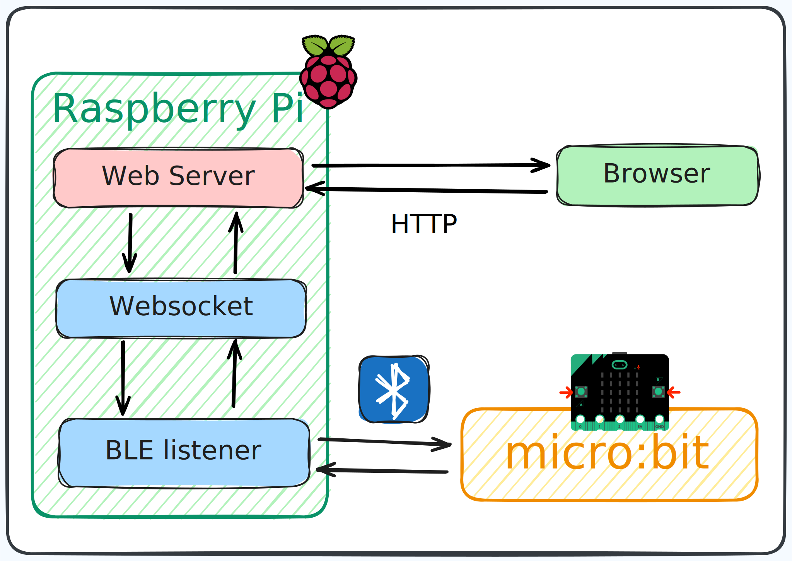

# LGRB Capstone Project

A multi-crate Rust project that connects an embedded device to a real‑time web dashboard.

- lgrcp-embed: Firmware for BBC micro:bit v2 (nRF52833) that produces button events over BLE or a serial/transport you choose.
- ble-listener: A host-side listener that receives button events from the device (e.g., via BLE) and forwards them to the web stack.
- ws-server: An Axum-based WebSocket + HTTP server that serves a dashboard and broadcasts events to connected browsers.

## Architecture

The diagram above shows the runtime layout:

- Raspberry Pi box (can also be any Linux/PC host) runs all host-side components.
- Web Server = ws-server crate. Serves the dashboard (/) and HTTP API (/api/button).
- WebSocket = /ws endpoint inside ws-server that broadcasts button events to browsers.
- BLE listener = ble-listener crate. Talks to the micro:bit over Bluetooth Low Energy and forwards events to ws-server.
- micro:bit = lgrcp-embed firmware that emits button events.
- Browser connects to http://HOST:3000, loads the dashboard, and stays connected via WebSocket for live updates.

Flow of events (typical setup):

1) micro:bit v2 (lgrcp-embed) → emits button events
2) Host machine (ble-listener) → receives/parses device events
3) ws-server → exposes POST /api/button and broadcasts events to /ws WebSocket clients
4) Browser dashboard (served at /) → visualizes real-time events

Notes about the diagram:
- Arrows between BLE listener and micro:bit indicate BLE communication.
- Double arrows between Web Server and Browser indicate HTTP requests and the persistent WebSocket channel.
- The editable source for the picture is embedded-project.svg at repo root; open and edit it with any SVG editor (e.g., Inkscape), then commit changes.

## Repositories and directories

- /lgrcp-embed — Embedded firmware for micro:bit v2. See its README for flashing/debugging details.
- /ble-listener — Host-side listener and forwarder for button events. (README TBD)
- /ws-server — Axum-based server with a simple dashboard, HTTP API, and WebSocket broadcasting.

## Prerequisites

- Rust toolchain (stable) with Cargo
- For embedded work (optional but recommended): probe-rs tools, appropriate Rust targets
- For BLE on your platform: OS-specific BLE support/tools depending on how ble-listener is implemented on your machine

## Quick start (local demo without hardware)

You can exercise the web stack even without hardware by posting mock events to ws-server.

1) Run the server
   - From repo root:
     - Debug: cargo run -p ws-server
     - Release: cargo run -p ws-server --release
   - Or from ws-server directory:
     - Debug: cargo run
     - Release: cargo run --release
   - Server listens on 0.0.0.0:3000

2) Open the dashboard
   - http://localhost:3000/

3) Post a test event (in another terminal):
   - curl -X POST http://localhost:3000/api/button \
       -H 'Content-Type: application/json' \
       -d '{"button":"A","state":"pressed","timestamp":1728011234}'

You should see the event appear in the dashboard’s live feed and charts.

## Running the full pipeline (with device)

- Flash lgrcp-embed onto your micro:bit v2. See lgrcp-embed/README.md for target and flashing instructions.
- Start ws-server as above.
- Run ble-listener to receive the device’s button events and forward them to the server’s POST /api/button. Consult ble-listener/src for current behavior until its README is finalized.

## Using the Makefile

This repository includes a Makefile with convenience targets (including cross-compilation for aarch64 and background service management):

- make build-ws-server — Build ws-server (cross target by default)
- make run — Start ws-server and ble-listener in the background; logs will be written under logs/
- make stop — Stop background services
- make logs-ws / make logs-all — Tail logs for ws-server or all services

Notes:
- If you’re not on aarch64, you may prefer running cargo directly without cross targets, or adjust the Makefile.
- You might need to install additional targets/toolchains: rustup target add aarch64-unknown-linux-gnu

## Component details

- ws-server: See ws-server/README.md for API (WebSocket /ws and HTTP POST /api/button), and dashboard details.
- lgrcp-embed: See lgrcp-embed/README.md for embedded setup (targets, flashing, debugging).
- ble-listener: Bridges device events to the server; README to be completed.

## Troubleshooting

- Nothing appears on the dashboard:
  - Ensure you’ve started ws-server and are posting valid JSON to /api/button.
  - Check browser console for WebSocket connection status.
  - If started via Makefile, check logs/ws-server.log.
- Port 3000 is in use:
  - Stop the conflicting service or adjust the binding in ws-server/src/main.rs.
- Cross-compilation issues:
  - Install required targets/toolchains; see ws-server/README.md notes.

## Project status

Active development. Interfaces and Makefile targets may change as the project evolves.

## License

Specify your preferred license here (e.g., MIT/Apache-2.0). If a LICENSE file exists, reference it accordingly.
