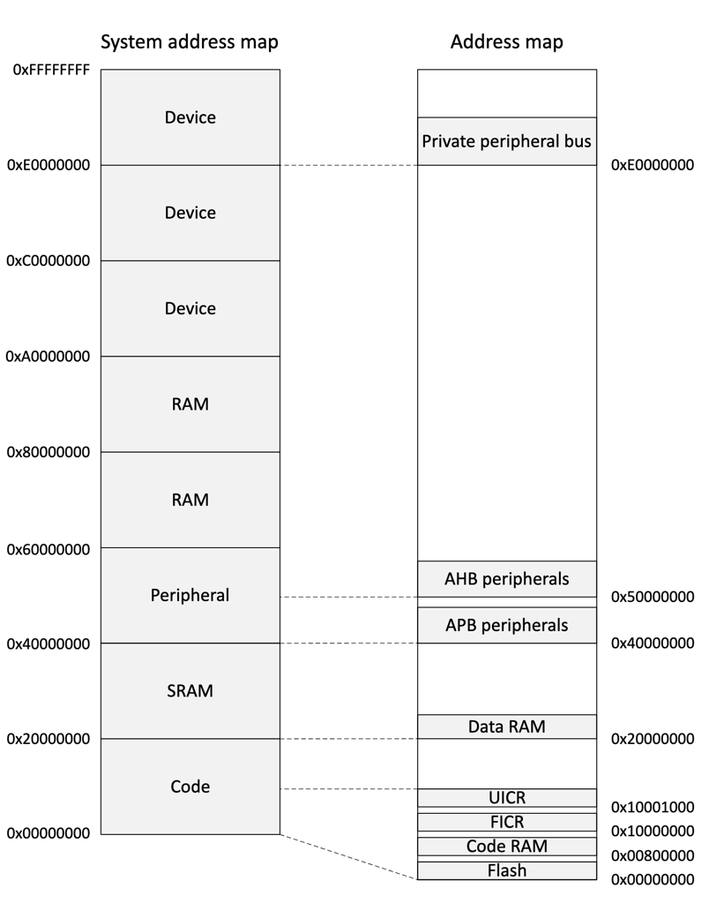

# Capstone Project: Embedded part

This crate contains the embedded firmware for the capstone project, targeting the BBC micro:bit v2 (Nordic nRF52833, Cortex-M4F).

# 🚀 Getting started
1. Install the Rust embedded tooling: see the official guide [Rust Embedded Book — Tooling](https://docs.rust-embedded.org/book/intro/tooling.html)
2. Install gdb, OpenOCD and QEMU (optional):
   - [Linux](https://docs.rust-embedded.org/book/intro/install/linux.html)
   - [macOS](https://docs.rust-embedded.org/book/intro/install/macos.html)
   - [Windows](https://docs.rust-embedded.org/book/intro/install/windows.html)
3. Install [probe-rs](https://probe.rs/) tools (for flashing/debugging):
   - cargo install probe-rs-tools
   - or cargo install cargo-flash
4. Run `make prepare` to install the required Rust components:
   - rustup target add thumbv7em-none-eabihf
   - rustup component add llvm-tools-preview
   - cargo install cargo-binutils

# ⚡️ Building and running
- Target architecture:
  - The micro:bit v2 (nRF52833, Cortex-M4F with FPU) typically uses the hard-float target: [thumbv7em-none-eabihf](https://doc.rust-lang.org/nightly/rustc/platform-support/thumbv7em-none-eabihf.html)
  - Note: The Makefile currently builds with `thumbv7m-none-eabi` in the `run` target. Ensure the target matches your board; you may want to change it to `thumbv7em-none-eabihf` for nRF52833.

- Build (recommended hard-float target):
  - cargo build --release --target thumbv7em-none-eabihf -p lgrcp-embed

- Binary size report:
  - make size

# 🔌 Flashing to hardware
You can flash using probe-rs. Examples:
- With probe-rs-cli:
  - probe-rs-cli download target/thumbv7em-none-eabihf/release/lgrcp-embed --chip nRF52833_xxAA
- With cargo-flash:
  - cargo flash --chip nRF52833_xxAA --release --target thumbv7em-none-eabihf -p lgrcp-embed

# 🐞 Debugging
- Start a GDB server with probe-rs:
  - probe-rs gdb --chip nRF52833_xxAA target/thumbv7em-none-eabihf/release/lgrcp-embed
- Then connect with arm-none-eabi-gdb:
  - arm-none-eabi-gdb target/thumbv7em-none-eabihf/release/lgrcp-embed
  - In GDB: target remote :1337

# 🧠 The cortex-m-rt crate
- This project uses cortex-m-rt and provides a linker script `memory.x`.

# 🗂 Project layout
- src/main.rs — firmware entry point
- Cargo.toml — dependencies and target configuration
- Makefile — helper targets (prepare, run, size)

# 🛠 Troubleshooting
- No probe detected: ensure udev rules (Linux) or proper drivers (Windows) are set up for your debug probe.
- Target mismatch: if flashing fails, verify you are building for `thumbv7em-none-eabihf` (hard-float) for nRF52833.
- Permissions: on Linux, you may need to run with proper udev rules or sudo (not recommended) for probe access.

# 📚 Resources
- [pcb-reflow-stm32-rust-rtic](https://github.com/marcinwionczyk/pcb-reflow-stm32-rust-rtic)
- [The Rusty Bits - Embedded Rust setup explained](https://www.youtube.com/watch?v=TOAynddiu5M)
- [The Rusty Bits - Blinking an LED: Embedded Rust ecosystem explored](https://www.youtube.com/watch?v=A9wvA_S6m7Y)

## Datasheets and references
- [nRF52 Application Processor (micro:bit v2)](https://tech.microbit.org/hardware/#nrf52-application-processor)
- [Product Specification nRF52833](https://docs-be.nordicsemi.com/bundle/ps_nrf52833/attach/nRF52833_PS_v1.7.pdf?_LANG=enus)
